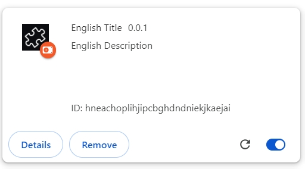
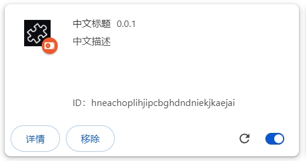

## the version of extension.js is `2.0.0-beta.1`.

`npm list -g | grep 'extension'`, output:

```
⠦├── extension@2.0.0-beta.1
```

```json5
  "devDependencies": {
    "extension": "2.0.0-beta.1" // i change the version from 'latest' to '2.0.0-beta.1' manually
  }
```

### `extension create extension_path_test_20240923 --template=new` 

output:

```
 - Starting a new browser extension named extension_path_test_20240923...
 - Ensuring extension_path_test_20240923 folder exists...
 - Checking if destination path is writeable...
 - Scanning for potential conflicting files...
 - Installing  extension_path_test_20240923 from template new...
Removing existing .go-git-it-temp-folder...
[==================================================] 100% 0.0s
 - Writing package.json metadata...
  - Installing dependencies... (takes a moment)
 - Writing README.md metadata...
 - Writing manifest.json metadata...
 - Initializing git repository for extension_path_test_20240923...
 - Writing .gitignore lines...
 -  Success! Extension extension_path_test_20240923 created.
```

### `npm run dev` 

output:

```
> _path_test@0.0.1 dev
> extension dev

✖︎✖︎✖︎ __MSG_extName__ compiled with errors in 1100 ms.
ERROR in [webpack-extension-target]
Path starts with "_" is preserved by the browser.
The browser will refuse to load this extension.
Please adjust your webpack configuration to remove that.
File(s) starts with "_":
    _locales\en\messages.json
    _locales\zh_CN\messages.json
```

### `npm run build` 

output:

```
> extension_path_test_20240923@0.0.1 build
> extension build

►►► __MSG_extName__ compiled successfully in 555 ms.
►►► Building __MSG_extName__ extension using Chrome defaults...

.
├─ icons
│  └─ extension_48.png (1.35KB)
├─ chrome_url_overrides
│  ├─ newtab.css (1.25KB)
│  ├─ newtab.html (0.68KB)
│  └─ newtab.js (0.08KB)
├─ manifest.json (0.30KB)
├─ _locales\zh_CN\messages.json (0.13KB)
└─ _locales\en\messages.json (0.12KB)

Version: 0.0.1
Size: 3.91KB
Build Target: Chrome
Build Status: Success

Build completed in 0.56 seconds.
►►► No errors or warnings found. Your extension is ready for deployment.
```

load ext pkg from `dist/chrome` :

locale en:



locale zh_CN:



